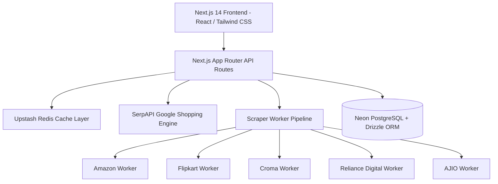

# 💰 MoneySaver (SaverStack) — Comprehensive Project Documentation

> **"Never pay full price again — stack every coupon, card offer, gift voucher, and cashback in one click."**

[](https://moneysaver-five.vercel.app)
[](https://github.com/Abhish37/MoneySaver)
[](.)
[](https://nextjs.org/)

---

## 📌 Executive Summary & Product Vision

### Problem Statement
Indian e-commerce is hyper-fragmented. An online shopper looking for a product (e.g., *iPhone 16*, *Foxtale Vitamin C Serum*, *Nike Shoes*) faces severe price friction across platforms:
1. **Price Fragmentation**: The same product is listed at different prices across Amazon.in, Flipkart, Nykaa, Myntra, Croma, Reliance Digital, and Tata CLiQ.
2. **Hidden Savings Layers**: Users miss out on discounts because savings are spread across store promo codes, bank credit/debit card instant discounts, discounted gift cards (Gyftr/Zave), and affiliate cashbacks (CashKaro/EarnKaro).
3. **Wasted Reward Coupons**: Reward vouchers earned on UPI platforms (GPay, PhonePe, Paytm) often expire unused because users forget they hold them.
4. **False Coupon Claims**: Standard coupon aggregator websites display expired, invalid, or clickbait coupon codes.

### MoneySaver Solution
MoneySaver is a **real-time product search, price aggregation, and multi-tier savings stacker platform** designed specifically for Indian shoppers. It provides:
- **Direct Live Product Comparison**: Fetches actual product prices, ratings, and listing URLs across supported Indian retailers.
- **5-Layer Savings Stacker Engine**: Calculates net payable prices by layering store discounts, active promo codes, gift vouchers, bank card instant discounts, and affiliate cashbacks.
- **OCR Screenshot Coupon Vault**: Uses OCR parsing to extract promo codes, amounts, and expiry dates from uploaded GPay/PhonePe reward screenshots.
- **Card & Payment Optimizer**: Matches user credit/debit cards with active merchant promotions to maximize checkout discounts.

---

## 🏗️ Technology Stack



### Frontend
- **Framework**: [Next.js 14.2 (App Router)](https://nextjs.org/)
- **UI Library & Styling**: Vanilla CSS + Tailwind CSS with Glassmorphism aesthetic, dark mode palette (`slate-950`), custom CSS animations.
- **State & Router**: React `useState`, `useEffect`, `useRef`, Next.js `useRouter`.
- **Icons & Typography**: Google Fonts (Inter), Native Emojis.

### Backend & API Architecture
- **API Runtime**: Next.js Serverless Route Handlers (`app/api/v1/...`).
- **Real-Time Data Aggregation**: SerpAPI Google Shopping API (`gl=in`, `hl=en`).
- **Scraper Worker Architecture**: Object-Oriented Worker pattern (`BaseWorker` interface) with error boundary fallback logic.
- **Query Understanding & Normalization**: Built-in Knowledge Graph, fuzzy Levenshtein typo correction dictionary, title cleaner, and entity brand extractor.

### Database & Caching
- **Primary Database**: Neon Serverless PostgreSQL.
- **ORM**: Drizzle ORM with TypeScript schemas (`db/schema/*`).
- **Cache Store**: Upstash Redis (`lib/redis.ts`, `backend/cache/searchCache.ts`) with configurable TTL (Search: 15m, Product: 30m, Store: 24h).

### Authentication & Infrastructure
- **Auth Architecture**: Session-based auth abstraction (`lib/auth/session.ts`) with Clerk JIT synchronization hook support (`lib/auth/jitSync.ts`).
- **Hosting & Deployment**: Vercel Serverless Platform (`https://moneysaver-five.vercel.app`).
- **Source Control**: GitHub (`Abhish37/MoneySaver`).

---

## ⚡ Core Features & Functional Breakdown

### 1. Real-Time Multi-Retailer Product Search & Aggregation
- **Behavior**: Triggered exclusively via button click or `Enter` key (preventing wasteful API calls on keystrokes).
- **Typo Correction**: Automatically corrects misspellings (e.g., `bluberry` → `blueberry`, `mccafine` → `mcaffeine`, `samung` → `samsung`).
- **Entity Matching**: Groups similar items from different retailers into a single canonical Product Card.
- **Direct Merchant Links**: All "Buy Now" links redirect directly to verified retailer search endpoints (`amazon.in/s?k=...`, `flipkart.com/search?q=...`, `nykaa.com/search/result/?q=...`) rather than intermediary search engine links.

### 2. The 5-Layer Savings Stacker Engine
Calculates the absolute **Net Payable Price** using sequential discount layers:

$$\text{Net Payable} = \text{MRP} - \text{Store Discount} - \text{Coupon Code} - \text{Gift Voucher} - \text{Bank Instant Discount} - \text{Affiliate Cashback}$$

```
  Base Product MRP (Manufacturer Suggested Price)
    ↓  − Store Discount (Listed Selling Price)
    ↓  − Coupon / Promo Code Discount
    ↓  − Discounted Gift Voucher (Gyftr / Zave 5% off)
    ↓  − Bank Credit/Debit Card Instant Discount (10% off)
    ↓  − Affiliate Cashback (CashKaro / EarnKaro %)
  ======================================================
  = NET FINAL PAYABLE AMOUNT
```

### 3. Interactive "View Stack" Savings Breakdown Modal
- Users can click **"View Stack"** on any offer card to view a complete step-by-step mathematical breakdown.
- Features transparent explainability strings detailing exact calculations.
- Includes mandatory ASCI (Advertising Standards Council of India) affiliate disclosures.

### 4. OCR Coupon Vault (Screenshot Parser)
- Users can upload reward screenshots from Google Pay, PhonePe, or Paytm.
- OCR pipeline extracts:
  - Promo Code string
  - Discount value or percentage
  - Platform/Brand applicability
  - Expiry date
- Stores verified coupons in the user's personal vault for auto-application during stack calculations.

### 5. Payment & Card Optimizer (`/cards`)
- Users can register their active credit/debit cards (e.g., HDFC Millennia, ICICI Amazon Pay, Axis Flipkart).
- Calculates which card yields the maximum instant discount or reward points for a specific cart total.

### 6. Brand & Category Discovery Grid
- Clean category filtering: *Fashion*, *Beauty & Skincare*, *Health & Wellness*, *Electronics*, *Food & Grocery*, *Travel*.
- Displays verified merchant cards with store status, typical cashback rates, and quick deal links.

---

## 🗄️ Database Schema Architecture

The database is built on PostgreSQL via **Drizzle ORM** with 8 core tables:

| Table Name | Purpose | Key Fields |
|---|---|---|
| `users` | User accounts & session stats | `id`, `email`, `name`, `cumulativeSavings`, `createdAt` |
| `products` | Canonical product registry | `id`, `canonicalTitle`, `brand`, `category`, `createdAt` |
| `productVariants` | Specific SKU variants (e.g. 128GB, Blue) | `id`, `productId`, `variantLabel`, `attributes` (JSONB) |
| `retailers` | Merchant metadata | `id`, `name`, `slug`, `domain`, `logoUrl`, `isActive` |
| `retailerProducts` | Live scraped listings per merchant | `id`, `variantId`, `retailerId`, `currentPrice`, `mrp`, `listingUrl`, `inStock` |
| `coupons` | System & Community coupon vault | `id`, `code`, `platform`, `discountType`, `discountValue`, `expiry`, `upvotes`, `downvotes` |
| `priceHistory` | Historical price tracking points | `id`, `retailerProductId`, `price`, `recordedAt` |
| `userCards` | Registered user payment cards | `id`, `userId`, `bankName`, `cardName`, `cardType` |

---

## 📁 Repository Directory Structure

```
MoneySaver/
├── app/                        # Next.js 14 App Router Pages & API Routes
│   ├── (auth)/                 # Auth routes (onboarding, login, register)
│   ├── (dashboard)/            # Dashboard layout group
│   │   ├── cards/              # Card Optimizer page
│   │   ├── dashboard/          # Main Product Search & Discovery dashboard
│   │   ├── deals/[storeSlug]/  # Store-specific deals page
│   │   ├── profile/            # User profile & saved stacks
│   │   ├── settings/           # User settings
│   │   ├── stacker/            # Standalone Savings Stacker calculator
│   │   └── vault/              # OCR Coupon Vault page
│   ├── api/v1/                 # REST API Endpoints
│   │   ├── auth/               # Webhooks & auth sync
│   │   ├── coupons/            # Coupon flagging & vault routes
│   │   ├── products/           # Live search & product details APIs
│   │   ├── stacker/            # Calculation engine API
│   │   ├── user/               # User cards management
│   │   ├── vault/              # OCR screenshot upload route
│   │   └── watchlist/          # Saved products API
│   ├── layout.tsx              # Root layout
│   └── page.tsx                # Landing page
├── backend/                    # Core Business Logic & Data Processing
│   ├── cache/                  # Redis caching layer (searchCache.ts)
│   ├── matcher/                # Entity matching & grouping algorithm
│   ├── normalizer/             # Raw listing cleaner & offer text parser
│   ├── query-understanding.ts  # Intent resolution & Knowledge Graph
│   ├── types.ts                # Core TypeScript interfaces
│   └── workers/                # Scraper Workers (Amazon, Flipkart, Croma, etc.)
├── components/                 # Reusable React UI Components
│   ├── BrandCard.tsx           # Category brand card
│   ├── Header.tsx              # Application top bar
│   ├── MobileNav.tsx           # Responsive bottom navigation bar
│   ├── OCRUploadModal.tsx      # Screenshot upload & parser UI
│   ├── StackerCard.tsx         # Savings layer summary card
│   └── ViewStackModal.tsx      # Detailed savings breakdown modal
├── db/                         # Database Configurations & Schemas
│   ├── schema/                 # Drizzle schema definitions
│   └── seed.ts                 # Database seed script
├── docs/                       # Project Documentation & PRDs
│   ├── PRD.md                  # Product Requirements Document
│   ├── TRD.md                  # Technical Requirements Document
│   └── PROJECT_DOCUMENTATION.html # Printable PDF documentation
├── lib/                        # Shared Utilities & Clients
│   ├── auth/                   # Local session & Clerk sync helpers
│   ├── data/                   # Default store catalog & brand definitions
│   ├── db/                     # Drizzle database client instance
│   ├── ocr/                    # Screenshot parser logic
│   ├── ratelimit.ts            # Upstash rate limiting configuration
│   ├── redis.ts                # Redis client instance
│   └── scraper/                # Client-side product search connector
├── .env.example                # Environment variables template
├── .gitignore                  # Git ignore rules
├── drizzle.config.ts           # Drizzle ORM configuration
├── next.config.mjs             # Next.js configuration
├── package.json                # Dependencies & scripts
├── README.md                   # Project overview & quickstart
└── tailwind.config.ts          # Tailwind CSS styling tokens
```

---

## 🌐 API Endpoint Reference

| Method | Endpoint | Description | Query / Body Parameters |
|---|---|---|---|
| `GET` | `/api/v1/products/search` | Performs live product search across merchants | `q` (query string) |
| `GET` | `/api/v1/products/[id]` | Retrieves details for a specific product | `id` (product ID) |
| `GET` | `/api/v1/products/[id]/prices` | Fetches cross-platform price comparison matrix | `id` (product ID) |
| `GET` | `/api/v1/products/[id]/history` | Retrieves historical price points | `id` (product ID) |
| `POST` | `/api/v1/stacker/calculate` | Computes 5-layer savings stack | `{ productId, storeSlug, userCardIds }` |
| `POST` | `/api/v1/vault/ocr-upload` | Processes reward screenshot via OCR | `FormData` (`file`) |
| `GET` | `/api/v1/user/cards` | Fetches registered payment cards for active user | Header Session Token |
| `POST` | `/api/v1/user/cards` | Registers a new payment card | `{ bankName, cardName, cardType }` |
| `GET` | `/api/v1/watchlist` | Fetches user's saved watchlist products | Header Session Token |
| `POST` | `/api/v1/watchlist` | Adds a product to user's watchlist | `{ productId }` |

---

## 🔒 Security & Data Integrity Policies

1. **Zero-Fabrication Policy**: MoneySaver strictly forbids hallucinating or fabricating fake coupons, prices, or cashback rates. If data cannot be verified or derived from a live source or structured Knowledge Base, it is omitted.
2. **Environment Protection**: All sensitive API keys (`SERPAPI_KEY`, `DATABASE_URL`, `UPSTASH_REDIS_REST_TOKEN`) are securely injected via Vercel environment variables and explicitly ignored in `.gitignore`.
3. **Affiliate Transparency**: ASCI-compliant badges and explicit affiliate notices accompany all outbound merchant links.
4. **Resilient Rate Limiting**: Upstash Redis rate limiters protect API routes against DDOS or abuse.

---

*Documentation compiled for MoneySaver (SaverStack) — Version 0.1.0-alpha.*
